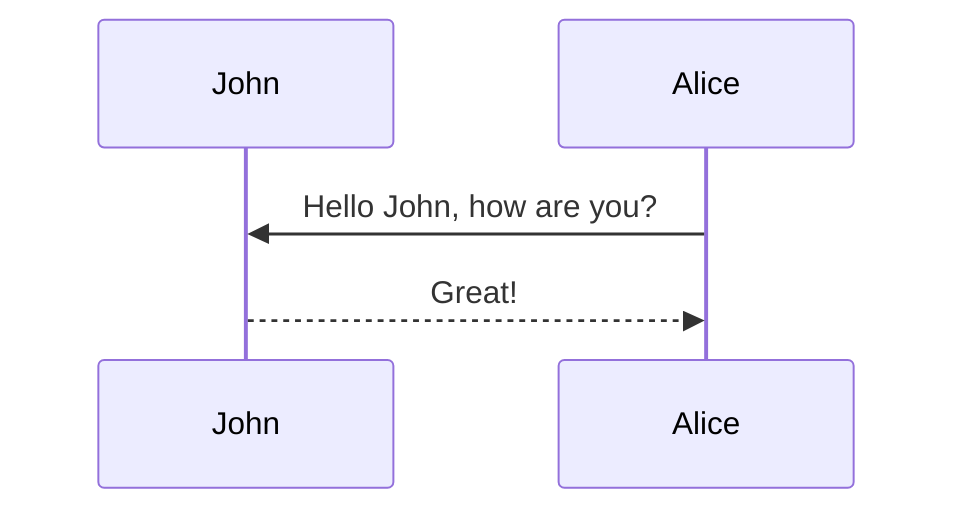

## Abstract

<div class="row mt-3">
    <div class="col-sm mt-3 mt-md-0">
        
    </div>
    <div class="col-sm mt-3 mt-md-0">
        
    </div>
</div>
<div class="caption">
    A simple, elegant caption looks good between image rows, after each row, or doesn't have to be there at all.
</div>

Abstract Abstract Abstract Abstract Abstract Abstract Abstract Abstract Abstract Abstract

## Introduction

<div class="row mt-3">
    <div class="col-sm mt-3 mt-md-0">
        
    </div>
    <div class="col-sm mt-3 mt-md-0">
        
    </div>
</div>
<div class="caption">
    A simple, elegant caption looks good between video rows, after each row, or doesn't have to be there at all.
</div>

Introduction Introduction Introduction Introduction Introduction Introduction Introduction Introduction

## Related Work

Related WorkRelated WorkRelated WorkRelated WorkRelated WorkRelated WorkRelated WorkRelated Work

## Method

$$
E=mc^2
$$

Method Method Method Method Method Method Method Method Method $$E=mc^2$$ Method

## Experiment





Regular text





> A quote





Hipster list

- brunch
- fixie
- raybans
- messenger bag





| Left aligned | Center aligned | Right aligned |
| :----------- | :------------: | ------------: |
| Left 1       |    center 1    |       right 1 |
| Left 2       |    center 2    |       right 2 |
| Left 3       |    center 3    |       right 3 |

<p></p>

Experiment Experiment Experiment Experiment Experiment Experiment Experiment Experiment

## Discussion

```c++
int main(int argc, char const \*argv[])
{
    string myString;

    cout << "input a string: ";
    getline(cin, myString);
    int length = myString.length();

    char charArray = new char * [length];

    charArray = myString;
    for(int i = 0; i < length; ++i){
        cout << charArray[i] << " ";
    }

    return 0;
}
```

Discussion Discussion Discussion Discussion Discussion Discussion Discussion Discussion

## Reference

Citations are then used in the article body with the `<d-cite>` tag.
The key attribute is a reference to the id provided in the bibliography.
The key attribute can take multiple ids, separated by commas.

The citation is presented inline like this: <d-cite key="jacobs2023deepspeed"></d-cite> (a number that displays more information on hover).
If you have an appendix, a bibliography is automatically created and populated in it.

Distill chose a numerical inline citation style to improve readability of citation dense articles and because many of the benefits of longer citations are obviated by displaying more information on hover.
However, we consider it good style to mention author last names if you discuss something at length and it fits into the flow well — the authors are human and it’s nice for them to have the community associate them with their work.

Just wrap the text you would like to show up in a footnote in a `<d-footnote>` tag.
The number of the footnote will be automatically generated.<d-footnote>This will become a hoverable footnote.</d-footnote>

## Appendix

Appendix Appendix Appendix Appendix Appendix Appendix Appendix Appendix Appendix Appendix

### mermaid



### jupyter notebook

{::nomarkdown}






<p>Sorry, the notebook you are looking for does not exist.</p>

{:/nomarkdown}

### chartjs

```chartjs
{
  "type": "line",
  "data": {
    "labels": [
      "January",
      "February",
      "March",
      "April",
      "May",
      "June",
      "July"
    ],
    "datasets": [
      {
        "label": "# of bugs",
        "fill": false,
        "lineTension": 0.1,
        "backgroundColor": "rgba(75,192,192,0.4)",
        "borderColor": "rgba(75,192,192,1)",
        "borderCapStyle": "butt",
        "borderDash": [],
        "borderDashOffset": 0,
        "borderJoinStyle": "miter",
        "pointBorderColor": "rgba(75,192,192,1)",
        "pointBackgroundColor": "#fff",
        "pointBorderWidth": 1,
        "pointHoverRadius": 5,
        "pointHoverBackgroundColor": "rgba(75,192,192,1)",
        "pointHoverBorderColor": "rgba(220,220,220,1)",
        "pointHoverBorderWidth": 2,
        "pointRadius": 1,
        "pointHitRadius": 10,
        "data": [
          65,
          59,
          80,
          81,
          56,
          55,
          40
        ],
        "spanGaps": false
      }
    ]
  },
  "options": {}
}
```

### echarts

```echarts
{
  "title": {
    "text": "ECharts Getting Started Example"
  },
  "responsive": true,
  "tooltip": {},
  "legend": {
    "top": "30px",
    "data": ["sales"]
  },
  "xAxis": {
    "data": ["Shirts", "Cardigans", "Chiffons", "Pants", "Heels", "Socks"]
  },
  "yAxis": {},
  "series": [
    {
      "name": "sales",
      "type": "bar",
      "data": [5, 20, 36, 10, 10, 20]
    }
  ]
}
```

### geojson

```geojson
{
  "type": "FeatureCollection",
  "features": [
    {
      "type": "Feature",
      "properties": {},
      "geometry": {
        "coordinates": [
          [
            [
              -60.11363029935569,
              -2.904625022183211
            ],
            [
              -60.11363029935569,
              -3.162613728707967
            ],
            [
              -59.820894493858034,
              -3.162613728707967
            ],
            [
              -59.820894493858034,
              -2.904625022183211
            ],
            [
              -60.11363029935569,
              -2.904625022183211
            ]
          ]
        ],
        "type": "Polygon"
      }
    }
  ]
}
```

### code diff

```diff
diff --git a/sample.js b/sample.js
index 0000001..0ddf2ba
--- a/sample.js
+++ b/sample.js
@@ -1 +1 @@
-console.log("Hello World!")
+console.log("Hello from Diff2Html!")
```

### vega lite

```vega_lite
{
  "$schema": "https://vega.github.io/schema/vega-lite/v5.json",
  "description": "A dot plot showing each movie in the database, and the difference from the average movie rating. The display is sorted by year to visualize everything in sequential order. The graph is for all Movies before 2019.",
  "data": {
    "url": "https://raw.githubusercontent.com/vega/vega/main/docs/data/movies.json"
  },
  "transform": [
    {"filter": "datum['IMDB Rating'] != null"},
    {"filter": {"timeUnit": "year", "field": "Release Date", "range": [null, 2019]}},
    {
      "joinaggregate": [{
        "op": "mean",
        "field": "IMDB Rating",
        "as": "AverageRating"
      }]
    },
    {
      "calculate": "datum['IMDB Rating'] - datum.AverageRating",
      "as": "RatingDelta"
    }
  ],
  "mark": "point",
  "encoding": {
    "x": {
      "field": "Release Date",
      "type": "temporal"
    },
    "y": {
      "field": "RatingDelta",
      "type": "quantitative",
      "title": "Rating Delta"
    },
    "color": {
      "field": "RatingDelta",
      "type": "quantitative",
      "scale": {"domainMid": 0},
      "title": "Rating Delta"
    }
  }
}
```

### typograms

```typograms
.------------------------.
|.----------------------.|
||"https://example.com" ||
|'----------------------'|
| ______________________ |
||                      ||
||   Welcome!           ||
||                      ||
||                      ||
||  .----------------.  ||
||  | username       |  ||
||  '----------------'  ||
||  .----------------.  ||
||  |"*******"       |  ||
||  '----------------'  ||
||                      ||
||  .----------------.  ||
||  |   "Sign-up"    |  ||
||  '----------------'  ||
||                      ||
|+----------------------+|
.------------------------.
```
